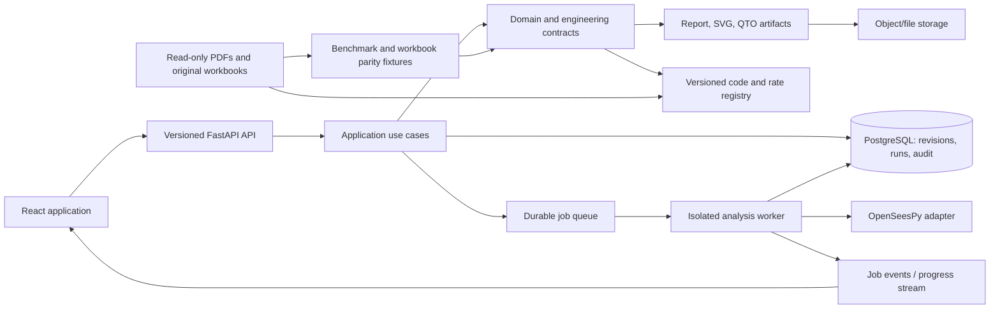

# DesignBook Grand Implementation Plan

## Executive summary

DesignBook will become a traceable, engineer-reviewed RCC structural-design workspace for Bangladesh. It will lead a user through a controlled sequence—project definition, model creation, loading, analysis, member design, detailing, quantity take-off, costing, and reporting—while keeping every engineering conclusion reproducible from a versioned input snapshot.

The current codebase is a prototype, not a production structural-design system. It includes useful FastAPI, React, OpenSeesPy, calculation, and reference-data foundations, but several critical paths are placeholders or disconnected: asynchronous analysis, real-time progress, Excel integration, time-history analysis, parts of the frontend workflow, migration management, and type safety. Historic documentation that claimed production readiness must not be treated as evidence of validation.

This plan deliberately starts with a narrow, independently verifiable vertical slice. It prioritises calculation integrity, source provenance, reviewability, and safe failure behaviour before breadth, automation, or visual polish.

## 1. Product mandate

### 1.1 Vision

Provide a professional “structural workspace” for qualified engineers that makes a building model, its assumptions, calculations, governing load combinations, checks, drawings, quantities, and report outputs easy to inspect and reproduce.

### 1.2 V1 product boundary

The first supported release covers regular low- and mid-rise reinforced-concrete frame buildings within an explicitly approved BNBC 2020 / ACI 318 scope:

- regular, orthogonal grids with storeys and conventional beam-column framing;
- SI-unit project/site/material data, gravity load cases, and approved strength/service combinations;
- linear elastic gravity analysis, then reviewed equivalent-static wind and seismic procedures;
- beam, column, one-way slab, two-way slab, isolated footing, combined footing, and shear-wall design—introduced one family at a time only after validation;
- project revisioning, run history, 2D/3D model viewing, result tables/plots, controlled PDF reporting, quantity take-off, and PWD-based costing where the rate source is approved;
- engineer/reviewer roles, calculation provenance, warnings, and reproducible artifacts.

### 1.3 Explicitly out of scope until separately released

- nonlinear time-history analysis, pushover, fibre-section modelling, and automatic plastic-hinge design;
- soil-structure interaction, raft/soil spring design, base isolation, and liquefaction analysis;
- irregular/high-rise systems, transfer structures, prestressed concrete, steel, tanks, domes, piles, and specialist structures;
- automatic site data from maps, DXF/DWG/BIM import, multi-user collaboration, and multi-code calculation support;
- any representation that generated results are approved construction documents without professional review.

Every unavailable or partially validated option must be hidden, disabled, or visibly labelled **Prototype / Not certified for design**. It must never output an unqualified “Pass” status.

## 2. Current baseline after repository cleanup

The workspace has been reduced to source, reference assets, supporting instructions, and a compact source-only history archive.

| Asset class | Status | Handling rule |
|---|---|---|
| Regulatory sources | 16 PDF files, including BNBC 2020 and PWD SoR | Preserve as read-only reference material. Record edition/page provenance whenever encoded. |
| Calculation sources | 34 XLS/XLSX workbooks | Preserve originals; never treat them as silent black-box production calculation engines. |
| Current application | FastAPI backend + React/Vite frontend prototype | Refactor incrementally behind tests and stable contracts. |
| Historic versions | `archive/legacy-source/` | Retained source-only because there is no Git history; never deploy it. |
| Runtime/build outputs | Removed | Regenerate from manifests only; keep ignored. |

Known baseline facts to resolve in Phase 0:

- Python source syntax compiles, but the recorded static type report contains 122 errors.
- The installed frontend dependencies were incomplete (missing the Windows Rolldown native binding) and were removed; a clean lockfile installation must be validated in CI.
- Existing analysis tasks and WebSocket status routes are explicit stubs.
- Existing dashboard and setup screens contain demonstration data and non-persisted form state.
- Current Docker/Nginx configuration does not create a complete production frontend image or an immutable release workflow.

## 3. Operating principles and non-negotiable gates

1. **Safety over feature count.** A smaller verified module is more valuable than an unvalidated comprehensive screen.
2. **No magic values.** Every code factor, rate, assumption, and design limit has a source, edition, unit, and effective-date reference.
3. **One canonical model.** API payloads, database records, analysis inputs, design inputs, UI state, and report data derive from versioned domain contracts.
4. **Immutable calculation snapshots.** A run can never change after it starts. Later edits create a new project revision.
5. **SI internally.** Calculate and persist in SI units; perform display-unit conversion only at the UI/report boundary and test it explicitly.
6. **Isolate OpenSeesPy.** The engine’s global state is rebuilt inside a separate worker process for every analysis. A solver failure must not corrupt another run or the API process.
7. **Reviewable automation.** Auto-sizing or design loops show iteration history, constraints, governing checks, and terminal manual-review outcomes.
8. **Fail closed.** Missing inputs, unknown applicability, solver non-convergence, or unverified code data returns a warning/error—not guessed output.
9. **Accessibility and clarity.** Analytical complexity is expressed with readable units, definitions, code references, and keyboard-accessible interaction.
10. **Reproducible release evidence.** No release occurs without benchmark outputs, regression tests, known limitations, and reviewer approval.

## 4. Primary users and end-to-end journeys

### 4.1 Roles

| Role | Main permissions | Expected outcome |
|---|---|---|
| Design engineer | Create/edit project revisions, run supported calculations, generate draft artifacts | A traceable design package for review. |
| Reviewing engineer | View revisions/runs/artifacts, add findings, approve or reject a run | A documented professional review decision. |
| Project administrator | Manage users, access, retention, reference-data releases | A controlled, auditable workspace. |
| System operator | Observe jobs, error rates, queues, backups, release health | A reliable and recoverable service. |

### 4.2 Core V1 journey

1. Engineer creates a project and its first revision, selecting permitted code edition, units, and building system.
2. Engineer enters location/site assumptions, materials, grid lines, storeys, members, supports, and loads. The system validates topology and completeness.
3. Engineer previews model geometry and load/combinations. The system identifies unsupported geometry before analysis is permitted.
4. Engineer creates an analysis run from a frozen revision and watches queued/running/failed/completed state with meaningful diagnostics.
5. Engineer reviews reactions, displacements, force envelopes, drift checks, calculation warnings, and governing combinations.
6. Engineer starts design runs for supported member families. The system exposes input values, forces, capacity calculations, detailing data, and code references.
7. Engineer generates a draft report from the exact snapshot; it contains disclaimer, reviewer state, source references, and known limitations.
8. Reviewer approves/rejects the result. Approval is an audit event bound to exact project, calculation, code-data, and artifact versions.

## 5. Target architecture



### 5.1 Backend layers

```text
app/backend/
  api/                  # HTTP/WebSocket interfaces; no calculation logic
  application/          # commands/queries and transaction boundaries
  domain/               # project aggregates, units, errors, result contracts
  engineering/
    codes/              # versioned BNBC/ACI/PWD datasets and citation metadata
    loads/              # self-weight, gravity, wind, seismic and combinations
    analysis/           # structural model, solver-neutral results, OpenSees adapter
    design/             # member-family calculations and detailing data
    verification/       # parity and benchmark runners
  infrastructure/       # SQLAlchemy, Alembic, workers, storage, logging
  tests/                # unit, fixture, contract, integration and benchmark tests
```

The existing `core/` can be migrated module-by-module; do not perform a risky all-at-once rename. New code enters the target layers, while existing code is wrapped, tested, then moved or retired.

### 5.2 Frontend composition

```text
app/frontend/src/
  app/                  # router, providers, error boundary, app shell
  api/                  # generated typed client, query/mutation hooks
  features/
    projects/           # project list, revisions, metadata
    model/              # grid/storey/member editor and validation
    loads/              # load cases and combinations
    analysis/           # run control, job status, result inspection
    design/             # member checks, loop history, detailing data
    reports/            # artifact configuration and downloads
  components/           # reusable accessible controls and data displays
  visualization/        # derived 2D/3D geometry only; no domain authority
  lib/                  # units, formatting, date/time, feature flags
```

The frontend must use server-state queries for persisted data and a local draft store only for unsaved edits. It must not maintain a second, divergent engineering model.

## 6. Canonical data model

### 6.1 Core aggregates

| Aggregate | Key data | Invariants |
|---|---|---|
| Project | identity, title, ownership, lifecycle state | Projects never directly contain mutable engineering inputs. |
| ProjectRevision | sequential revision, author, parent, frozen timestamp | Exactly one immutable snapshot per calculation run. |
| BuildingModel | system type, grid, storeys, nodes, members, supports, materials | Coordinates/units valid; topology complete; no duplicate member identity. |
| LoadModel | named load cases, targets, distributions, combination set | Units compatible; every combination references valid cases. |
| AnalysisSettings | method, modes, solver tolerances, permitted options | Settings limited to released scope. |
| AnalysisRun | snapshot hash, job state, warnings, engine/version metadata | One run is immutable and independently reproducible. |
| DesignRun | member scope, demand source, calculation versions, result status | Design always points to a completed input/analysis snapshot. |
| Artifact | type, storage key, render version, checksum | Every artifact identifies source revision and run IDs. |
| Approval | reviewer, decision, findings, timestamp | Approval cannot be transferred to another snapshot. |

### 6.2 Required provenance fields

Every calculated result must carry: project revision ID; model/load snapshot hash; analysis/design module version; source code/edition; relevant clause/table/page; input/output unit system; governing case/combination; created time; worker/solver version; warnings; and review status.

### 6.3 Persistence rules

- PostgreSQL is the system of record; Redis is never the sole store of project or result data.
- Use Alembic migrations for all schema evolution. Remove runtime `create_all` outside local test fixtures.
- Store large files/artifacts in managed object/file storage with checksums; store metadata and access control in PostgreSQL.
- Use optimistic concurrency and draft revision locks to prevent silent overwrites.
- Retain source input snapshots and released artifacts according to an explicit project retention policy.

## 7. Reference-data and calculation-governance program

### 7.1 Regulation and code registry

Create a versioned registry with columns for standard, edition, jurisdiction, chapter/clause/table, page, value/formula, unit, applicability condition, source file hash, effective date, reviewer, and implementation status. Code values are selected by context—not copied across modules as constants.

Prioritise BNBC 2020 Part VI for structural requirements and PWD SoR 2022 for rates. Other PDFs remain context references until their relevance and licensing are reviewed.

### 7.2 Workbook inventory and parity

For each of the 34 supplied spreadsheets, create a machine-readable inventory:

- file/workbook hash, sheet names, title/purpose, standard edition, and author assumptions;
- protected/yellow input cells, formulas, named ranges, charts, outputs, and units;
- whether the workbook is reliable reference, legacy example, incomplete, or out of V1 scope;
- approved fixtures: input values, expected results, tolerances, and reviewer notes;
- the corresponding Python module and test identifiers once implemented.

Original workbooks remain unchanged. Enhancements/export templates are separate generated artifacts and must clearly state their version and limitations.

### 7.3 Engineering validation board

No calculation becomes “supported” until a qualified reviewer approves: requirements, code citations, numerical method, hand calculation/approved workbook comparison, boundary/error handling, test coverage, and UI/report language. Maintain this status in a public capability matrix.

## 8. Detailed delivery roadmap

### Phase 0 — Foundation reset and delivery controls

**Objectives**

- establish a clean reproducible repository; convert unsupported assertions into factual capability status; and create CI quality gates.

**Work packages**

1. Add `.env.example`; move secrets out of defaults; document local, test, staging, and production configuration.
2. Fix `.gitignore`, add a license decision, CODEOWNERS/reviewer map, `.editorconfig`, formatter/linter/type-check configuration, and dependency manifests.
3. Create CI jobs for backend syntax/lint/type/tests, frontend install/lint/build/tests, dependency scan, and artifact retention.
4. Introduce ADRs for application architecture, data snapshots, worker isolation, units, standard/version selection, storage, and authentication.
5. Create the capability matrix and rewrite all UI wording from implied verified status to prototype/released status.
6. Consolidate manual stress scripts into an explicit `tests/legacy/` backlog without deleting scenario knowledge until fixtures replace them.

**Exit criteria**

- clean checkout + documented install works on the CI operating system;
- no secret is committed; generated files remain ignored;
- baseline errors are measured and assigned; CI blocks new regressions;
- the repository’s documentation names the actual supported scope.

### Phase 1 — Contracts, migrations, and project revision lifecycle

**Objectives**

- make the project model and its revision history the single authoritative input to every later process.

**Work packages**

1. Define Pydantic v2 DTOs and domain value objects for units, materials, geometry, members, loads, combinations, analysis settings, code selections, result messages, and pagination/errors.
2. Replace duplicated frontend/backend types with OpenAPI code generation or a managed shared-contract workflow.
3. Design PostgreSQL schema, create initial Alembic migration, seed a development code-data release, and add transactional repositories.
4. Implement project CRUD, revision creation, clone/revert, draft autosave, revision diff, soft-delete, audit-event and access checks.
5. Add API contract tests and idempotency/concurrency handling for mutation endpoints.

**Exit criteria**

- a persisted project revision serialises to exactly the analysis input contract;
- all mutations identify an authenticated actor and revision;
- database can migrate forward from empty state and upgrade safely in CI.

### Phase 2 — Geometry, loads, combinations, and first calculation fixtures

**Objectives**

- deliver validated inputs for a regular frame and make the first calculations deterministic before touching asynchronous workflow.

**Work packages**

1. Implement grid/storey/member/support schemas with topology validation, member-local-axis conventions, material assignments, and SI dimensional validation.
2. Implement self-weight, superimposed dead load, live load, wall/line load, point load, and tributary-area allocation with an audit trace.
3. Implement an explicit load-combination catalogue chosen by code/version/context, with identifiers, factors, applicability, and printable explanations.
4. Build test fixture packages for a small portal frame, a two-storey frame, and a regular mid-rise frame.
5. Create results contracts for forces, displacements, reactions, combinations, warnings, and failure diagnostics independent of OpenSeesPy return formats.

**Exit criteria**

- hand-calculated self-weight and load-combination examples pass within documented tolerance;
- unsupported member layouts/load targets are rejected before analysis;
- a saved model rehydrates deterministically and produces identical pre-analysis input hashes.

### Phase 3 — Verified gravity-analysis vertical slice

**Objectives**

- run one trustworthy input-to-result analysis path for supported frames.

**Work packages**

1. Define a solver-neutral `StructuralModel` and a strict OpenSees model adapter.
2. Implement fresh model creation, node/element identification, material/section creation, supports, gravity patterns, static solve, force/reaction/displacement extraction, and unconditional cleanup.
3. Run all solver work in a child process with timeout, memory/time metrics, cancellation hooks, structured error normalization, and no fallback mock results.
4. Compare results to reviewed hand calculations and at least one approved external model benchmark.
5. Publish result tables with load-case/combo provenance, warnings, and numerical units.

**Exit criteria**

- at least two benchmark models pass acceptance tolerance;
- failed/non-converged models produce actionable errors with stored diagnostics;
- no analysis result appears without an immutable input snapshot and solver metadata.

### Phase 4 — Initial member design: beams and columns

**Objectives**

- take verified demands through transparent, cited member design checks.

**Work packages**

1. Specify beam and column design requirements, accepted limits, failure modes, code clauses, and material assumptions with reviewers.
2. Refactor beam/column calculators into pure, typed functions with inputs/outputs and dimensional tests.
3. Implement flexure, shear, minimum/maximum reinforcement, detailing constraints, slenderness and interaction/biaxial logic only within approved scope.
4. Implement calculation traces that show inputs, intermediate values, equations/clauses, capacities, demands, utilization, status, and messages.
5. Create workbook-parity and hand-calculation fixtures; publish tolerance rationale.
6. Add structured rebar/detailing data for the later rendering layer without generating construction drawings yet.

**Exit criteria**

- reviewed beam and column examples pass regression tests;
- an engineer can trace any status back to its governing demand and code source;
- invalid/out-of-scope cases are refused or marked manual review.

### Phase 5 — Usable frontend vertical slice

**Objectives**

- make the verified backend workflow usable without mock data.

**Work packages**

1. Add an app shell, authentication boundary, loading/error/empty states, route guards, global API error handling, and an accessible design-system baseline.
2. Replace demo dashboard cards with project/revision data, recent actual runs, real warnings, and clear status indicators.
3. Implement project setup, grid/storey/member editor, material/site assumptions, and load-case editor using typed forms and server validation.
4. Implement a 2D model view derived solely from persisted/draft geometry; add 3D visualization only after the 2D editor is trustworthy.
5. Implement analysis-run control, job progress, result tables, member selection, and beam/column design inspection.
6. Add end-to-end tests for the user journey and accessibility tests for fields, errors, focus order, and keyboard operation.

**Exit criteria**

- a new user can complete the V1 journey with no demo values or console errors;
- the UI cannot imply success when the underlying job/check is failed or unsupported;
- browser tests cover project-to-draft-report workflow.

### Phase 6 — Durable jobs, progress, and results lifecycle

**Objectives**

- convert analytical execution into a safe, observable, recoverable service.

**Work packages**

1. Replace placeholder Celery jobs with database-backed command execution and explicit queue/run states: queued, validating, building, solving, extracting, completed, warning, failed, cancelled, expired.
2. Persist job events and stream them over WebSocket/SSE with polling fallback, reconnect semantics, authorization, and back-pressure.
3. Add cancellation before/within safe solver boundaries; timeout, retry classification, duplicate-job guards, and dead-letter/error investigation workflow.
4. Instrument latency, memory, run sizes, queue depth, error classes, and benchmark metrics.
5. Add operator UI or protected diagnostics endpoints, retention/cleanup policy, and alert thresholds.

**Exit criteria**

- concurrent jobs cannot share OpenSees state;
- retries are safe and never overwrite the original result;
- users receive precise, persisted failure reasons and operators can diagnose them.

### Phase 7 — Lateral loads and structural checks

**Objectives**

- add lateral analysis in controlled increments, releasing only independently benchmarked methods.

**Delivery order**

1. BNBC wind: input/exposure validation, velocity pressure, coefficients, pressure zones, floor forces, base shear, overturning, and governing cases.
2. BNBC equivalent-static seismic: zone/site/importance/system parameters, seismic weight, period treatment, base shear, vertical distribution, and directional cases.
3. Linear lateral solver results, storey displacements, drift, torsional indicators, P-Delta stability coefficient checks, and serviceability summaries.
4. Modal analysis: mass modelling, eigen extraction, mode-shape storage, participation ratios, and diagnostics.
5. Response spectrum: spectra input/governance, modal combination (SRSS/CQC), scaling, and code-required checks.

Time-history, nonlinear, and automatic hinge workflows are excluded from this phase.

**Exit criteria**

- each method has an engineering requirements document, benchmark suite, code citations, governing-combination displays, and limitations;
- users cannot combine results produced under incompatible assumptions.

### Phase 8 — Member-family expansion and controlled design loops

**Objectives**

- add one reviewed design family at a time while keeping a uniform calculation contract.

**Release order**

1. one-way and two-way slabs;
2. isolated and combined footings, bearing/punching checks, and geotechnical input boundaries;
3. shear walls and retaining walls;
4. quantity-aware reinforcement/detailing data for released families;
5. auto-design loop only after stable individual checks exist.

**Design-loop rules**

- user chooses allowed variables (section dimensions, reinforcement sizes/counts) and locks any protected values;
- each iteration stores demand, revised assumptions, checks, governing failure, and convergence measure;
- iteration count/time is bounded; loop ends as pass, manual-review-required, infeasible, or solver-failed;
- no automatic resizing crosses geometric, architectural, code, or user constraints;
- a reviewer can reproduce the complete loop from the run snapshot.

### Phase 9 — Detailing, QTO, costing, and report artifacts

**Objectives**

- turn validated data into readable and reproducible professional outputs.

**Work packages**

1. Define canonical reinforcement, bar-mark, schedule, cover, splice/development, section/elevation, and drawing-note domain data.
2. Render SVG detail diagrams from canonical data; visually regression-test output and label every release status.
3. Derive quantities from the exact model/design snapshot, including calculation basis and unit assumptions.
4. Maintain versioned PWD-rate datasets separate from quantities; show rate source/effective date and pricing exclusions.
5. Build templated PDF reports with cover, scope/disclaimer, revision and approval state, source references, inputs, load combinations, analysis, designs, warnings, QTO, costing, and appendices.
6. Add artifact checksum, deterministic naming, storage access controls, and report reproduction tests.

**Exit criteria**

- regenerated report checksum/content is consistent for an unchanged snapshot;
- report clearly distinguishes calculation data, reviewer approval, warnings, and unsupported scope.

### Phase 10 — Production readiness and controlled rollout

**Objectives**

- make a reviewed V1 deployment secure, operable, recoverable, and supportable.

**Work packages**

1. Authentication, organisation/project authorization, reviewer permissions, audit logging, password/SSO policy, and service-account rules.
2. Safe uploads: type/size validation, quarantine/malware scanning strategy, object storage, document retention/deletion policy, and no execution of user-provided scripts.
3. Build frontend production image, API/worker images, migration job, reverse proxy/TLS, secure headers, CORS, health/readiness checks, structured logging, metrics, tracing, and alerts.
4. Add backup/restore, disaster-recovery test, migration rollback strategy, dependency/SBOM/license scanning, secret rotation, and incident runbooks.
5. Use feature flags and a pilot cohort; collect engineering review feedback before broad release.

**Exit criteria**

- staging passes full E2E, security, recovery, performance, accessibility, and operational-readiness reviews;
- release evidence and known limitations are signed off by accountable reviewers.

## 9. API and job contract design

### 9.1 Versioned HTTP surface

```text
/api/v1/projects
/api/v1/projects/{projectId}/revisions
/api/v1/revisions/{revisionId}/model
/api/v1/revisions/{revisionId}/loads
/api/v1/revisions/{revisionId}/combinations
/api/v1/revisions/{revisionId}/analysis-runs
/api/v1/analysis-runs/{runId}
/api/v1/analysis-runs/{runId}/results
/api/v1/revisions/{revisionId}/design-runs
/api/v1/design-runs/{runId}
/api/v1/artifacts/{artifactId}
/api/v1/reference-data/releases
```

Use consistent envelopes for pagination, field validation, domain errors, request correlation ID, problem type, and actionable remediation. Never expose raw database or solver exceptions directly to end users.

### 9.2 Analysis state machine

```text
draft -> queued -> validating -> building -> solving -> extracting -> completed
                     |             |            |             |
                     +--> failed <-+------------+-------------+
queued/validating/building/solving -> cancellation_requested -> cancelled
completed -> superseded (when a newer revision is selected; never mutated)
```

All transitions are persisted as events. A process restart must be able to determine whether to resume safely, mark a run interrupted, or require an intentional retry.

## 10. Verification and test strategy

| Test layer | Required evidence |
|---|---|
| Unit/dimensional | Formula cases, units, rounding, validation boundaries, zero/negative/None handling. |
| Golden fixture | Stable input/output JSON for each calculation module and code-data release. |
| Workbook parity | Approved fixture comparison to original workbooks with tolerance and rationale. |
| Hand calculations | Reviewed independent examples for each released calculation path. |
| External benchmark | Comparison to an approved external analysis model where applicable. |
| API contract | OpenAPI/schema compatibility and auth/error behaviour. |
| Integration | Project revision -> worker -> analysis -> design -> report against ephemeral Postgres/Redis. |
| Browser E2E | Supported user journey, failed state, accessibility, visual geometry/result sanity. |
| Non-functional | Solver isolation, cancellation, queue load, rate limits, memory/time budgets, backup/restore. |
| Release evidence | Versioned benchmark report, reviewer decision, known limitations and artefact checksums. |

### Minimum benchmark catalogue

- single beam and column hand calculations;
- one-bay portal frame gravity analysis;
- regular two-storey frame with known reactions/displacements;
- regular multi-storey frame for gravity/lateral distribution;
- at least one controlled bad-model/convergence failure test;
- one fixture per supported original workbook; and
- one approved external comparison per major analysis method.

## 11. UX, visualization, and reporting standards

- Field labels always show SI units, valid range, source/assumption tooltip, and required status.
- Display both numerical utilization and an unambiguous state: pass, warning, fail, unsupported, pending review, or failed computation.
- Results retain governing case/combo and open the calculation trace on demand.
- Show computation progress as real persisted events, never decorative progress bars.
- 3D visualisation is a read-only interpretation of the canonical model; it cannot author hidden engineering data.
- Data tables provide filter/export/copy access and remain usable without WebGL.
- PDFs use a clear draft/reviewed/approved watermark, report the code-data release and artifact source IDs, and include the limitation statement.

## 12. Security, privacy, and compliance workstream

1. Use secure secrets management; never store credentials in source or artifact output.
2. Apply tenant/project authorization to every project, run, artifact, WebSocket, and download endpoint.
3. Record security-relevant audit events: login, access grant, revision update, run launch/cancel, artifact export, and approval.
4. Validate all user inputs and uploads; use allow-lists, resource limits, quarantine, and safe parsers for workbook/PDF processing.
5. Separate production data from test fixtures; redact project-sensitive content in logs and error monitoring.
6. Maintain dependency inventory, vulnerability response process, licence review, and source-document usage review.
7. Define data ownership, retention, backup, restoration, export, and deletion obligations before production onboarding.

## 13. Infrastructure and environment plan

### Local development

- one documented bootstrap command using pinned Python/Node versions;
- Docker Compose for Postgres/Redis only initially, with optional full-container smoke test;
- deterministic package installation from lockfiles and requirements constraints;
- seeded anonymised fixtures; no production code/rates/secrets required to run tests.

### CI

1. dependency installation and lockfile integrity;
2. backend format/lint/type/unit tests;
3. frontend format/lint/type/build/component tests;
4. integration test stack using disposable services;
5. security/license/SBOM scan;
6. benchmark regression suite and artifact retention;
7. protected main branch requiring review and passing gates.

### Staging and production

- immutable API, worker, and frontend images;
- migration job before application rollout;
- health/readiness/liveness checks, TLS, environment-specific configuration, central logs/metrics/traces;
- managed backups, encryption at rest/in transit, least-privilege service accounts, and tested recovery procedures;
- blue/green or canary rollout for calculation-engine changes, with benchmark comparison before promotion.

## 14. Delivery management and indicative sequencing

The sequence below assumes a cross-functional team with a structural-engineering reviewer. Calendar duration depends on validation availability; no date is meaningful until scope and reviewers are confirmed.

| Increment | Depends on | Demonstrable outcome |
|---|---|---|
| I0: Baseline | None | Clean, reproducible repository and factual capability matrix. |
| I1: Project contract | I0 | Revisioned project and validated model/load persistence. |
| I2: Gravity engine | I1 | Benchmarked regular-frame gravity analysis API. |
| I3: Beam/column | I2 | Reviewed demand-to-design calculation traces. |
| I4: Engineer UI | I1–I3 | Real project-to-analysis-to-design user journey. |
| I5: Durable runs | I2 | Safe asynchronous jobs, event stream, diagnostics. |
| I6: Lateral | I2/I5 | Reviewed wind and ESFM releases. |
| I7: Expanded members | I3/I6 | Released member families, one at a time. |
| I8: Artifacts | I3/I7 | Traceable detailing/QTO/draft-report outputs. |
| I9: Production pilot | All V1 increments | Secure, operable staged pilot with approval workflow. |

### Responsibility model

- **Engineering lead:** scope, standards interpretation, benchmark approval, release sign-off.
- **Backend/analysis engineer:** domain contracts, solver isolation, calculations, verification tooling.
- **Frontend engineer:** user workflow, typed API integration, accessible model/result UI, visualisation.
- **Platform engineer:** CI, releases, observability, environments, backups, security controls.
- **QA/validation engineer:** fixtures, regression harnesses, E2E flows, release evidence.
- **Product owner:** V1 priority decisions, usability feedback, pilot governance.

## 15. Risk register

| Risk | Impact | Mitigation / gate |
|---|---|---|
| Incorrect or outdated code parameters | Unsafe results | Versioned source registry, reviewer approval, clause/page provenance, regression fixtures. |
| Hidden spreadsheet assumptions | False parity | Explicit workbook inventory, limitation notes, hand-check validation. |
| OpenSees global state or crashes | Corrupted/inconsistent runs | One isolated process per run, cleanup, timeouts, normalized failures. |
| Scope explosion across member types | Long unverified project | Narrow V1 and one-family-at-a-time release gates. |
| Demo UI presented as real result | Loss of trust/unsafe use | Remove mock data, capability flags, server-backed status only. |
| Inconsistent data contracts | Calculation/revision mismatch | Canonical DTOs, generated client, contract tests, immutable snapshots. |
| Numerical instability | Run failures/misleading answers | Model validation, solver diagnostics, benchmarks, no fallback fake result. |
| Regulatory/source licensing uncertainty | Legal and delivery risk | Confirm rights/effective editions before encoding or distributing derived material. |
| No reviewer capacity | Cannot certify features | Make reviewer assignment a prerequisite for each engineering increment. |
| Operational data loss or exposure | Client/regulatory risk | Least privilege, backups, restore drills, audit logs, secure artifact handling. |

## 16. Decision log to complete before Phase 1

1. Which exact code editions, clauses, and source files may be encoded and distributed?
2. Which building typology/member families define V1 and what are the maximum dimensions/storeys/irregularities?
3. Who is accountable for engineering validation and what formal approval meaning is required?
4. What benchmark sources and tolerances will be accepted for each calculation type?
5. What user/organisation/authentication model is required for the first pilot?
6. Where will project data, uploaded files, and generated reports be hosted, retained, backed up, and restored?
7. Does the first pilot need cost estimation and report export, or can those follow the verified design slice?
8. What regional/legal disclaimers, data-residency requirements, and report-signing process apply?

## 17. Definition of done for every engineering feature

An engineering feature is complete only when all items below are present:

- defined V1 scope and applicability boundaries;
- approved code/source references and versioned parameters;
- typed input/output contract with SI units and input validation;
- deterministic implementation with no mock/fallback calculation output;
- calculation trace, governing case, warnings, and error conditions;
- unit, fixture, parity, and benchmark tests with documented tolerance;
- persisted provenance, audit event, API, frontend, and report representation;
- security/authorization and operational considerations where relevant;
- user-visible limitation text and reviewer approval;
- passing CI and release evidence attached to the implementation version.

Anything short of this remains clearly labelled Prototype or Planned.
